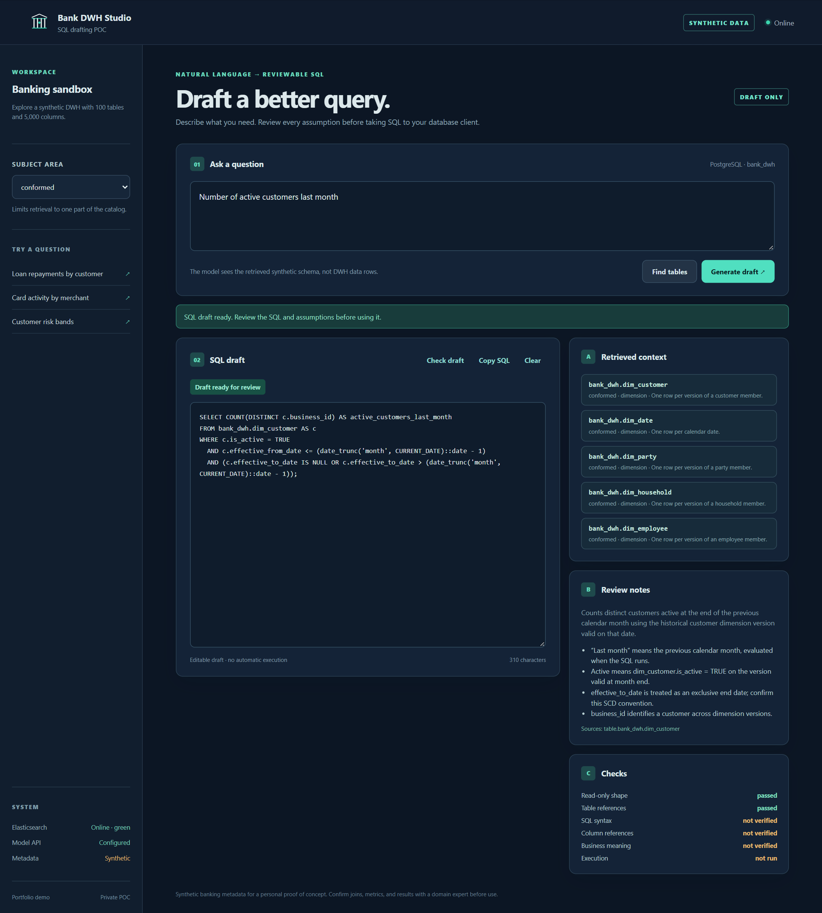
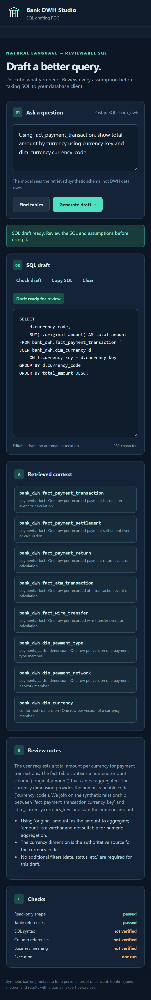
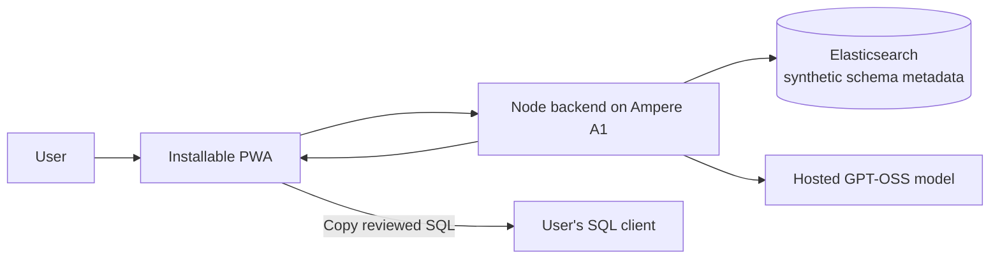

# Bank DWH Studio

An invite-only PWA that turns natural-language banking questions into **editable, reviewable PostgreSQL SQL drafts**. This personal proof of concept runs on an Oracle Ampere A1 instance and searches a synthetic banking warehouse catalog with **100 tables and 5,000 columns**. It uses Elasticsearch for schema retrieval and a hosted GPT-OSS model for SQL drafting.

**[Open the PWA](https://semantic-layer-poc.zandaulion.com/)** (invite required) · **[Browse all 10 portfolio screenshots](portfolio/README.md)**

| Desktop | Phone |
|---|---|
|  |  |

The [portfolio gallery](portfolio/README.md) covers ten banking questions at desktop, laptop, tablet, and phone sizes. Its SQL examples were generated by the POC backend against the synthetic catalog; the screenshots render recorded responses in the PWA for repeatable capture.

## How it works

1. A user asks a question and can narrow the search to a banking subject area.
2. The Node backend retrieves relevant table metadata from Elasticsearch. It sends bounded schema context to the hosted model or applies a catalog-grounded rule for supported common questions.
3. The PWA shows the SQL draft, retrieved tables, interpretation, assumptions, and basic checks. It can ask for a missing detail, such as the year in an end-of-August question, and keeps a per-device history of generated answers.
4. The user edits or copies the SQL for review and runs it separately in their own database client.



## Portability to a different inference backend

The model is reached through `MODEL_BASE_URL`, an OpenAI-compatible
`/chat/completions` endpoint, so pointing this at an on-prem inference server
instead of a hosted provider is a configuration change rather than a port. That
makes it easy to assume the two behave identically. They need not: constrained
JSON decoding, quantisation, and vendor parameters such as `reasoning_effort` all
vary by server, and those differences surface as different SQL rather than as
errors.

[The evaluation harness](app/eval/README.md) measures that instead of assuming
it. It runs the real pipeline over twelve questions whose correct answers the
fixture schema determines, and writes a comparable result file per backend:

```bash
podman exec banking-dwh node eval/run.mjs --label onprem --out /tmp/onprem.json
podman exec banking-dwh node eval/run.mjs --compare app/eval/baselines/groq-gpt-oss-20b.json /tmp/onprem.json
```

A second backend to compare against needs no GPU: `app/deploy/quadlet/gpt-oss-local.container`
serves the same `gpt-oss-20b` weights from CPU through llama.cpp, so the
comparison can be run on the machine that already hosts the POC. The same
weights were also served by vLLM on a rented RTX 4090, the server an on-prem
deployment would most likely use, and `app/eval/load.mjs` measured that card
under rising concurrency. The runs are recorded in `app/eval/baselines/` and
compared in [app/eval/RESULTS.md](app/eval/RESULTS.md). The backends agreed on
every required table and none violated the JSON schema contract, even with 64
requests batched on vLLM, but they differed on which dimensions they joined and
on whether a destructive request was refused outright or caught downstream by the
SQL check. One RTX 4090 saturated at about 270 questions a minute.

It reports table grounding, status behaviour, read-only safety, inference latency
and prompt size, and it classifies failures — a schema violation, meaning the
server did not honour the strict JSON schema the application depends on, is a
different problem from a rate limit, and the report says which happened.

The browser never receives the model API key. The PWA does not connect to a banking warehouse or execute generated SQL. Its automated checks cover read-only statement shape and known table references; syntax, column references, and business meaning still need human review.

## Explore the repository

The code here is a small proof of concept. The architecture documents describe a
possible full implementation and are deliberately wider in scope than anything
that runs on the A1 instance — they are a target, not a description of this
codebase. The two groups below are separated for that reason.

**What is built and deployed**

- [Component inventory](components.md): every architectural piece, its contract, and whether to reuse, port or reimplement it for an on-premise deployment.
- [Catalog contract](catalog-contract.md): the metadata input format — required fields, ignored fields, and what decides retrieval quality.
- [Configuration](configuration.md): every environment variable, every command, and the order things must start in.
- [PWA and A1 deployment](app/README.md): local run, Elasticsearch ingestion, hosted model configuration, invite gate, and Cloudflare route.
- [Portfolio gallery and capture method](portfolio/README.md): ten screenshots, questions, viewport sizes, recorded responses, and regeneration steps.
- [Synthetic banking warehouse fixture](banking-poc/README.md): PostgreSQL DDL, catalog, relationships, and a small seed for 100 tables and 5,000 columns.
- [Backend evaluation harness](app/eval/README.md): twelve schema-grounded questions, the scoring rules, and how to compare two inference backends.
- [Backend comparison results](app/eval/RESULTS.md): the same model served hosted, on CPU and by vLLM on a rented GPU, how one card behaves under load, what agreed, what did not, and what it does not settle.
- [Retrieval and naming](retrieval-and-naming.md): what happens to retrieval when the warehouse has bank-style abbreviated names instead of readable ones, and which metadata recovers it.

**Designs for a possible full implementation**

- [Elasticsearch metadata model](elasticsearch-metadata-model.md): the target indexing model, mapping, and sample documents. Its [section 9](elasticsearch-metadata-model.md#9-what-the-deployed-poc-actually-implements) records the much smaller subset the POC actually indexes — one document type, twelve fields, BM25 and no embeddings.
- [Minimal architecture proposal](minimal-logical-architecture.md) and [broader design](logical-architecture.md): reference designs for a later corporate implementation; these describe a different scope from this deployed A1 POC.

To regenerate and validate the warehouse fixture with Python's standard library:

```powershell
python generate_banking_warehouse.py
python validate_banking_warehouse.py
```

All warehouse names, relationships, and measures here are synthetic POC material, not approved banking definitions. The generated fixture is committed for inspection without running the generator.

## License

Released under [GPL-3.0-only](LICENSE). The PWA update files are adapted from [pwa-kit](https://github.com/zandaulion/pwa-kit), also GPL-3.0, at commit `e2ad9dced4f471afb3d307b00af214dacd0d2e6e`. The invite administration API follows the contract of [pwa-invite-console](https://github.com/zandaulion/pwa-invite-console); that console's source is not bundled here.
