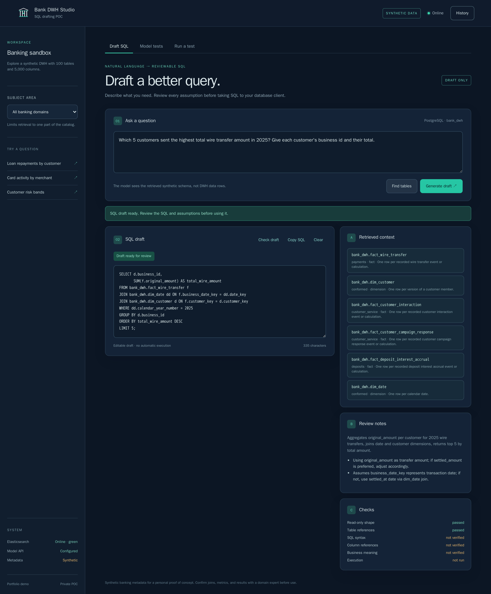
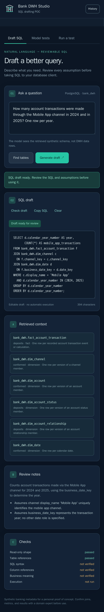
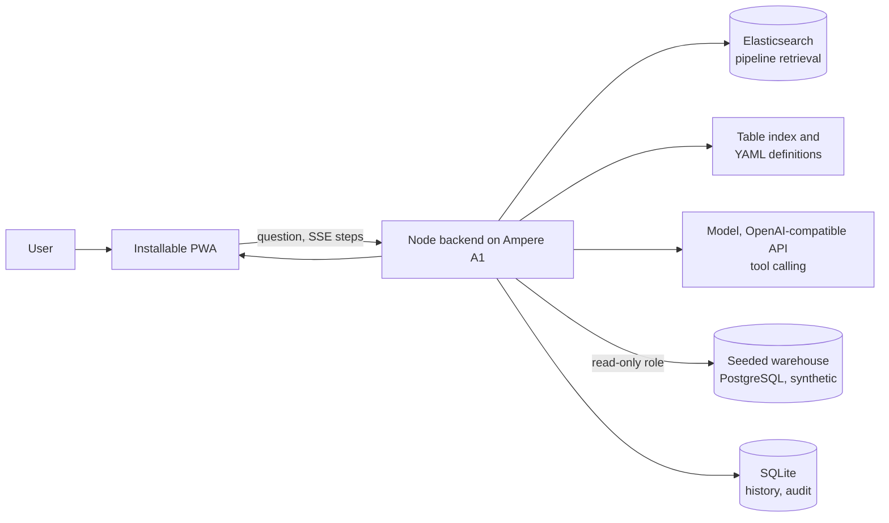

# Bank DWH Studio

An invite-only PWA that turns natural-language banking questions into **editable, reviewable PostgreSQL SQL drafts**. This personal proof of concept runs on an Oracle Ampere A1 instance and searches a synthetic banking warehouse catalog with **100 tables and 5,000 columns**. It answers in one of two modes: an **agent** that looks tables up with tools and tests its SQL against a seeded, read-only copy of the warehouse before answering, or a **pipeline** that retrieves the schema from Elasticsearch and drafts in a single model call. On the benchmark's hardest questions, with bank-style abbreviated names, the agent answers 76–96% correctly against the pipeline's 39–49% ([why](#agent-or-pipeline)).

**[Open the PWA](https://semantic-layer-poc.zandaulion.com/)** (invite required) · **[Browse all 10 portfolio screenshots](portfolio/README.md)**

| Desktop | Phone |
|---|---|
|  |  |

The [portfolio gallery](portfolio/README.md) covers ten hard banking questions at desktop, laptop, tablet, and phone sizes, taken from the model benchmark. Their SQL was drafted by the POC's own pipeline and model, and each draft was verified by running it against a seeded copy of the synthetic warehouse; the screenshots render those recorded responses in the PWA for repeatable capture.

## How it works

1. A user asks a question and can narrow the search to a banking subject area. The sidebar chooses the answer mode; `ANSWER_MODE` sets the default.
2. **Agent mode.** The model gets four tools: a fuzzy search over a table index, a lookup that returns one table's YAML definition (grain, columns, joins), `run_sql`, which runs a read-only query and shows up to 20 rows, and `submit_answer`. It searches, reads the tables it means to use, tests its draft, fixes what the database rejects, and submits. The index and the YAML files are generated from the same catalog the pipeline indexes, and the agent is also given a short set of [business rules](banking-poc/domain-rules.md).
3. **Pipeline mode.** The backend retrieves table metadata from Elasticsearch, assembles a bounded context, and makes one model call with a strict JSON schema, or applies a catalog-grounded rule for a few common questions.
4. Both modes end in the same reviewable answer: SQL, interpretation, assumptions, sources and checks. The page streams the agent's steps as they happen (server-sent events), runs a draft that passes the statement check against the warehouse as a read-only user, and shows the rows. Follow-up questions keep the conversation's earlier turns.
5. History is kept per device, and every question, executed statement and answer goes to an append-only audit log.


```mermaid
flowchart LR
    U[User] --> P[Installable PWA]
    P -->|question, SSE steps| A[Node backend on Ampere A1]
    A --> E[(Elasticsearch<br/>pipeline retrieval)]
    A --> Y[Table index and<br/>YAML definitions]
    A --> M[Model, OpenAI-compatible API<br/>tool calling]
    A -->|read-only role| W[(Seeded warehouse<br/>PostgreSQL, synthetic)]
    A --> S[(SQLite<br/>history, audit)]
    A --> P
```

The warehouse is the benchmark's seeded synthetic data, rebuilt from the seed at every start. The application connects as a role that can only `SELECT`, in read-only transactions, with a 15-second statement timeout and a row cap; drafts that fail the statement check are never sent. `AGENT_SQL_CHECK=explain` limits the agent's testing to `EXPLAIN`, so the model learns whether its SQL is valid and what it returns but never sees a row.

## Portability to a different inference backend

The model is reached through `MODEL_BASE_URL`, an OpenAI-compatible
`/chat/completions` endpoint, so pointing this at an on-prem inference server
instead of a hosted provider is a configuration change rather than a port. That
makes it easy to assume the two behave identically. They need not: constrained
JSON decoding, quantisation, and vendor parameters such as `reasoning_effort` all
vary by server, and those differences surface as different SQL rather than as
errors.

[The evaluation harness](app/eval/README.md) measures that instead of assuming
it. It runs the real pipeline over twelve questions whose correct answers the
fixture schema determines, and writes a comparable result file per backend:

```bash
podman exec banking-dwh node eval/run.mjs --label onprem --out /tmp/onprem.json
podman exec banking-dwh node eval/run.mjs --compare app/eval/baselines/groq-gpt-oss-20b.json /tmp/onprem.json
```

A second backend to compare against needs no GPU: `app/deploy/quadlet/gpt-oss-local.container`
serves the same `gpt-oss-20b` weights from CPU through llama.cpp, so the
comparison can be run on the machine that already hosts the POC. The same
weights were also served on a rented RTX 4090 by llama.cpp, by SGLang and by
vLLM, the server an on-prem deployment would most likely use, and
`app/eval/load.mjs` measured each under rising concurrency. The runs are
recorded in `app/eval/baselines/` and compared in
[app/eval/RESULTS.md](app/eval/RESULTS.md), which opens with a one-table
overview. The backends agreed on every
required table, but they differed on which dimensions they joined and on
whether a destructive request was refused outright or caught downstream by the
SQL check. vLLM held the JSON schema contract with 64 requests batched, and one
RTX 4090 saturated at about 270 questions a minute; llama.cpp reached about
half that. SGLang broke the contract under load, about one reply in fifty
running on in whitespace until the token limit, until it was started with
`--constrained-json-disable-any-whitespace`. The failure never appeared one
request at a time. On a rented A100, `gpt-oss-120b` matched the 20b on every
case at more than twice the GPU time per question, because the twelve cases
are too easy to separate the two models; the harder benchmark below found the
120b no better either. The 20b ran no faster on the A100 than on the RTX 4090. On a
catalog with abbreviated names and no descriptions, the 20b once drafted a
plausible query from the wrong table where the 120b asked instead.

It reports table grounding, status behaviour, read-only safety, inference latency
and prompt size, and it classifies failures — a schema violation, meaning the
server did not honour the strict JSON schema the application depends on, is a
different problem from a rate limit, and the report says which happened.

## Which model

Those twelve questions are ones any capable model answers, so they separate
servers, not models. [The model benchmark](app/eval/bench/README.md) asks 46
harder ones three times: 23 with a single right answer, scored by running each
draft against a seeded PostgreSQL copy of the warehouse; six about data the
warehouse does not hold, where the right answer is a question back; five
requests to write, which must never reach the user. For an open-weights model
it rents a GPU on RunPod, serves the model with vLLM (or llama.cpp, for a GGUF
quantisation), and deletes the GPU when
it is done, in 5 to 12 minutes and for well under a dollar, on an A100 by
default, the card an on-prem deployment would use. A closed model (Claude,
Gemini, GPT) is called through OpenRouter instead, billed per token, for
comparison: it could not run on the bank's hardware.

The number it watches is **confidently wrong**: a draft that runs and answers
wrongly, or an answer about data that does not exist. Both read as answers.

It runs twice over the same data and questions. Once with **cryptic names**,
abbreviated as an older bank warehouse spells them (`F_ACCT_BAL_D`, `CUST_K`,
column descriptions kept), and once with the catalog's **descriptive names**
(`fact_account_balance_daily`). The difference is large. On an A100, on
2026-09-27, with cryptic names:

| Model | Correct | Confidently wrong | With descriptive names | Questions/min |
| --- | --- | --- | --- | --- |
| Gemini 3.8 Flash (API, OpenRouter) | 72% | 1 | not run | rate-limited |
| Qwen3.8-27B (FP8) | 70% | 8 | 96%, 0 wrong | 31 |
| Claude Sonnet 5 (API, OpenRouter) | 70% | 12 | not run | rate-limited |
| GPT-5.5 (API, OpenRouter) | 68% | 9 | not run | rate-limited |
| GPT-4.1 (API, OpenRouter) | 68% | 18 | not run | rate-limited |
| GPT-4.1 mini (API, OpenRouter) | 65% | 15 | not run | 95 |
| Qwen3.6-35B-A3B (FP8) | 64% | 13 | 86%, 11 wrong | 90 |
| gpt-oss-120b | 62% | 14 | 86%, 8 wrong | 69 |
| gpt-oss-20b | 46% | 17 | 86%, 5 wrong | 153 |
| GPT-6 Luna (API, OpenRouter) | 22% | 1 | not run | rate-limited |
| Qwen3-Coder-Next (Q4_K_M GGUF, llama.cpp), 2026-10-08 | 25% | 1 | not run | 14 |

The closed models, reached through OpenRouter, are there for scale: they
cannot run on the bank's hardware. Qwen3-Coder-Next, the only model run from a
GGUF file, asked back on 49 of 69 hard questions rather than guess at the
abbreviations; as an agent it answered all of them (below). Gemini 3.8 Flash was the most careful,
asking back on 18 hard questions rather than guessing, and was wrong only once.
GPT-6 Luna took caution too far, asking back on 53 of 69, GPT-5.5 was the
only model to draft answers for data the warehouse does not hold (3 of 18),
and GPT-4.1 matched its accuracy with twice the confident mistakes (18), its
drafts rarely stopping to ask.
Every open model lost 22 to 39 points to the cryptic names. The mistakes are the ones the names used to
prevent: a guessed column (`D_CCY.CCY_CD1`, when the currency dimension's code
is `BUS_CD1`), a table read wrongly from its abbreviation (loan disbursements
for delinquency), and questions sent back as clarifications that were answered
before. None of them asked less about data that does not exist, and none let a
write through.

With descriptive names, on an A100, on 2026-09-26:

| Model | Correct | Confidently wrong | Asked when it should | Questions/min |
| --- | --- | --- | --- | --- |
| Qwen3.8-27B (FP8) | 96% | 0 | 18 of 18 | 41 |
| gpt-oss-20b | 86% | 5 | 18 of 18 | 198 |
| gpt-oss-120b | 86% | 8 | 18 of 18 | 81 |
| Qwen3.6-35B-A3B (FP8) | 86% | 11 | 14 of 18 | 128 |
| Mistral Small 3.2 24B | 41% | 9 | 15 of 18 | 53 |

Gemma 2 9B answered 35% with 35 confidently wrong, and drafted an answer for
every question about data the warehouse does not hold; Ministral 3 14B answered
45% with 40 confidently wrong; EuroLLM-22B, the EU-funded model, labelled nearly
every answer as a question and got none right. Gemma 4 26B could not be served
under strict JSON output, a known model regression, and Devstral Small 2, only
published in FP8, does not start on an A100 at all. The
PWA's **Model tests** tab shows every run, cryptic names first, each tagged
open or closed weights, and exports them as a PDF. Its **Run a test** tab checks
a model on Hugging Face or OpenRouter and runs it, for devices allowed to spend
money on runs.

The browser never receives the model API key. The PWA does not connect to a banking warehouse or execute generated SQL. Its automated checks cover read-only statement shape and known table references; syntax, column references, and business meaning still need human review.

## Agent or pipeline

The benchmark (below) runs both modes on the same questions, data and model.
With cryptic names, on an A100, 2026-10-02. T1 is the 23 questions described
below; T4 is 17 harder ones: record history as of a past date, joins between
two snapshot facts, currency conversion with daily rates, window functions,
medians, customers active in every quarter. Each is asked three times.

| Model | T4 agent | T4 pipeline | T1 agent | T1 pipeline | Agent confidently wrong, T1+T2 | Agent answer time (p50) |
| --- | --- | --- | --- | --- | --- | --- |
| Qwen3.8-27B (FP8) | 96% | 47% | 98.6% | 71% | 1 | 60 s |
| gpt-oss-120b | 96% | 51% | 92.8% | 65% | 5 | 22 s |
| Qwen3.6-35B-A3B (FP8) | 92% | 39% | 97.1% | 61% | 1 | 23 s |
| Qwen3.6-35B-A3B, `EXPLAIN` only | 84% | — | 100% | — | 0 | 19 s |
| gpt-oss-20b | 76% | 49% | 91.3% | 49% | 3 | 11 s |
| Qwen3-Coder-Next (Q4_K_M GGUF, llama.cpp), 2026-10-08 | 84% | 12% | 100%¹ | 25% | 0 | 115 s |

¹ Through llama.cpp, 16 agents at once on one A100 answered about 6 questions a
minute, against 41 for Qwen3.6-35B-A3B under vLLM, and 24 of 189 answers were
cut off by the GPU host's 100-second request limit. Those 24 were asked again
8 at a time, keeping the other 165; all passed. A deployment on llama.cpp
should size for fewer agents per card than the vLLM runs suggest.

For scale, the closed models through OpenRouter, in pipeline mode, on T4: Claude
Sonnet 5 71%, Gemini 3.8 Flash 69% (3 wrong, the most careful), GPT-4.1 mini
55%, GPT-4.1 49% (19 wrong), GPT-6 Luna 22% (it asks back on most questions).
Every open model run as an agent scored above every closed model run as a
pipeline.

Where the gain comes from was measured by taking the agent apart, with
gpt-oss-20b on T1:

| Variant | Correct | Did not run | Confidently wrong |
| --- | --- | --- | --- |
| Pipeline | 46% | 7 | 17 |
| Pipeline with the agent's business rules | 55% | 8 | 12 |
| Agent: lookups only, no `run_sql`, no rules | 61% | 25 | 4 |
| Agent without `run_sql` | 46% | 34 | 3 |
| Agent without the business rules | 98.6% | 0 | 2 |
| Agent | 94.2% | 0 | 2 |
| Agent, `run_sql` limited to `EXPLAIN` | 92.8% | 0 | 5 |

- **Looking tables up is what makes it safe.** Confidently wrong answers fall
  from 17 to 3–4 without any execution, because the agent finds the right fact
  where the pipeline's search never returned it, for example delinquency and
  loan balance tables.
- **Testing the draft is what makes it right.** Without `run_sql`, about half
  the drafts do not run: columns guessed on tables the model never read,
  mostly the date dimension. The database's error message is enough to fix
  them. `EXPLAIN` alone keeps nearly all of the gain, so the model need not
  see any data.
- **The business rules add nothing measurable** to the agent.
- **The cost is tokens and time.** An agent question uses about 18,000 tokens
  against the pipeline's 5,000 and takes 2 to 3 times as long. A provider's
  tokens-per-minute limit binds first: Groq's free tier held one agent
  question to about three minutes.

The harder questions separate the models where the original 23 no longer
could: gpt-oss-20b's misses on them are drafts that run and answer wrongly,
which execution feedback cannot catch.

## Explore the repository

The code here is a small proof of concept. The architecture documents describe a
possible full implementation and are deliberately wider in scope than anything
that runs on the A1 instance — they are a target, not a description of this
codebase. The two groups below are separated for that reason.

**What is built and deployed**

- [Component inventory](components.md): every architectural piece, its contract, and whether to reuse, port or reimplement it for an on-premise deployment.
- [Catalog contract](catalog-contract.md): the metadata input format — required fields, ignored fields, and what decides retrieval quality.
- [Configuration](configuration.md): every environment variable, every command, and the order things must start in, including [the answer modes and the warehouse](configuration.md#answer-mode-and-agent).
- [PWA and A1 deployment](app/README.md): local run, Elasticsearch ingestion, hosted model configuration, invite gate, and Cloudflare route.
- [Portfolio gallery and capture method](portfolio/README.md): ten screenshots of hard benchmark questions, each draft verified by running it, viewport sizes, and regeneration steps.
- [Synthetic banking warehouse fixture](banking-poc/README.md): PostgreSQL DDL, catalog, relationships, and a small seed for 100 tables and 5,000 columns.
- [Backend evaluation harness](app/eval/README.md): twelve schema-grounded questions, the scoring rules, and how to compare two inference backends.
- [Backend comparison results](app/eval/RESULTS.md): the same model served hosted, on CPU, and by llama.cpp and vLLM on a rented GPU, how one card behaves under load, what agreed, what did not, and what it does not settle.
- [Model benchmark](app/eval/bench/README.md): open models on a rented GPU and closed ones through OpenRouter, with descriptive and cryptic names, their SQL scored by running it against a seeded copy of the warehouse; how to add a model, what each profile needed to serve, and the guards on cost.
- [Retrieval and naming](retrieval-and-naming.md): what happens to retrieval when the warehouse has bank-style abbreviated names instead of readable ones, and which metadata recovers it.

**Designs for a possible full implementation**

- [Elasticsearch metadata model](elasticsearch-metadata-model.md): the target indexing model, mapping, and sample documents. Its [section 9](elasticsearch-metadata-model.md#9-what-the-deployed-poc-actually-implements) records the much smaller subset the POC actually indexes — one document type, twelve fields, BM25 and no embeddings.
- [Minimal architecture proposal](minimal-logical-architecture.md) and [broader design](logical-architecture.md): reference designs for a later corporate implementation; these describe a different scope from this deployed A1 POC.

To regenerate and validate the warehouse fixture with Python's standard library:

```powershell
python generate_banking_warehouse.py
python validate_banking_warehouse.py
```

All warehouse names, relationships, and measures here are synthetic POC material, not approved banking definitions. The generated fixture is committed for inspection without running the generator.

## License

Released under [GPL-3.0-only](LICENSE). The PWA update files are adapted from [pwa-kit](https://github.com/zandaulion/pwa-kit), also GPL-3.0, at commit `e2ad9dced4f471afb3d307b00af214dacd0d2e6e`. The invite administration API follows the contract of [pwa-invite-console](https://github.com/zandaulion/pwa-invite-console); that console's source is not bundled here.
