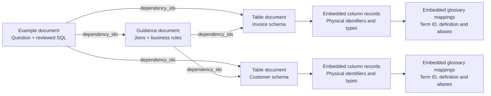

# Elasticsearch metadata model — minimal SQL assistant

This model extends the minimal POC/MVP architecture. It uses **one index, three document types, and ordinary ID references**. There is no Elasticsearch parent/child join, separate graph, or additional metadata database.

The index is a retrieval copy of selected Oracle metadata plus expert-reviewed guidance/examples. Oracle and the reviewed source files remain authoritative.

> **Scope.** This document is a design for a full implementation; it is not a
> description of the code in this repository. The deployed POC implements a
> strict subset — one document type, twelve fields, BM25 and no embeddings —
> which is set out in [section 9](#9-what-the-deployed-poc-actually-implements).

## 1. Deliverables and assumptions

- [Index creation body](elasticsearch-index-mapping.json) — explicit Elasticsearch field mappings.
- [Sample documents](elasticsearch-sample-documents.json) — two tables, one guidance document and one SQL example.
- [Minimal architecture](minimal-logical-architecture.md) — preparation and runtime flows.

The samples are fictitious and illustrate an Oracle 19c SQL target. This is not an assumption about the actual DWH. Replace the connection, dialect, schema, definitions, scopes and source references with real values.

The mapping uses **768 embedding dimensions as an illustrative configuration**. Set this to the chosen local encoder's actual dimension before creating the index. The sample documents intentionally omit vectors and embedding provenance: they can be indexed for lexical inspection but are not ready for a complete hybrid-search release. The loader must generate actual embeddings and populate the associated fields. Never substitute random or zero vectors.

Verify the mapping and search syntax against the installed Elasticsearch version before deployment. No index has been created by this documentation work.

## 2. Document boundaries and logical relationships

| Type | One document represents | Structured payload |
|---|---|---|
| `table` | One physical table or view in the selected domain | `table_metadata`: physical identity, grain, keys, columns and their glossary mappings |
| `guidance` | One small coherent set of approved domain rules and join instructions | `guidance`: join definitions, metric/filter descriptions, date roles and code mappings |
| `example` | One reviewed question/query pattern | `example`: question, SQL, explanation, parameter definitions and review reference |



Arrows are ID references or embedded ownership, not Elasticsearch joins. The backend fetches dependent documents by ID with the same scope filters as search. Business terms are embedded with their mapped columns; one term can appear on multiple columns/tables. The authoritative column association is the structured payload, not the flattened search fields.

The POC indexes the selected domain, not automatically all 12,000 terms. A future term-only glossary browsing feature can introduce another document type, but SQL drafting does not require it.

## 3. Common document envelope

Elasticsearch arrays use the field's normal mapping: for example, `dependency_ids` is an array of `keyword` values, not a separate array type.

| Field | Mapping | Population and purpose |
|---|---|---|
| `document_id` | `keyword` | Required stable ID; also use as Elasticsearch `_id` |
| `document_type` | `keyword` | Required enum: `table`, `guidance`, `example` |
| `domain_id` | `keyword` | Required selected business domain |
| `connection_id` | `keyword` | Required logical target DWH identifier; no credentials |
| `sql_dialect` | `keyword` | Required configured SQL engine name |
| `dialect_version` | `keyword` | Required configured target version/profile |
| `status` | `keyword` | Required `approved` for published POC content; loader governs admission |
| `access_scope_ids` | `keyword[]` | Required nonempty set of scopes permitted to see the entire document |
| `metadata_version` | `keyword` | Required snapshot/release identifier, identical across one published index |
| `content_version` | `integer` | Required positive version of this source content |
| `source_updated_at` | `date` | Latest known update across source records contributing to this document; omit if unknown |
| `indexed_at` | `date` | Required preparation-job timestamp |
| `title` | `text` + `exact` keyword subfield | Required concise display/search title |
| `search_text` | `text` | Required full lexical search text assembled by the loader |
| `physical_identifiers` | `keyword[]` | Exact fully qualified physical identifiers; normally populated for tables |
| `business_term_ids` | `keyword[]` | Deduplicated Accurity IDs associated with the document |
| `business_term_names` | `text[]` | Denormalized names for boosted lexical search |
| `aliases` | `text[]` | Business synonyms and alternate labels for lexical search |
| `dependency_ids` | `keyword[]` | Required array; empty when no other documents are required |
| `required_for_domain` | `boolean` | Required; true only for guidance always included for the domain |
| `source_references` | Stored object array | Required provenance records: system, record ID, optional verified source URL |
| `embedding_text` | Stored, non-indexed `text` | Required for hybrid publication; exact text sent to the encoder |
| `embedding_model_id` | `keyword` | Required for hybrid publication; exact local encoder/checkpoint identity |
| `embedding_pipeline_version` | `keyword` | Required for hybrid publication; text construction/prefix settings version |
| `embedding` | `dense_vector` | Required for hybrid publication; finite, nonzero vector with configured dimension |

Empty optional arrays are permitted. Exactly one of `table_metadata`, `guidance` or `example` must be populated, matching `document_type`.

`access_scope_ids` has OR semantics: possession of any listed scope allows reading the entire document. It must not be formed by taking the union of permissions for differently protected columns. Use one uniformly authorized domain for the POC. If visibility differs within a table, create appropriately scoped projections or enforce a more detailed policy before exposing documents to users or the model.

IDs should derive from stable source identifiers plus connection/domain/type, such as `table.dwh-poc.sales.pd-100`. Keep physical names as values, so a rename does not necessarily change the document's identity. A full rebuild removes deleted documents; other documents must not retain dangling dependencies.

## 4. Structured payloads

### Table document

| Field inside `table_metadata` | Content |
|---|---|
| `object_id` | Stable PowerDesigner/source object ID |
| `schema_name`, `object_name` | Exact physical names; add catalog name if the target engine requires it |
| `object_type` | `table` or `view` |
| `description` | Human-readable physical/business description |
| `grain` | What one row represents |
| `primary_key_column_ids` | Ordered source column IDs; support composite keys |
| `unique_key_column_id_sets` | Optional arrays describing other unique keys |
| `columns` | Complete structured column metadata for the supported table |

Each column contains `column_id`, exact `name`, `data_type`, `nullable`, `description`, and `business_terms`. Use null/unknown for unavailable facts rather than fabricating constraints. Each mapped business term contains `term_id`, `name`, `definition`, `aliases`, and a source reference. Additional mapping-specific explanations can remain in this stored payload.

Conceptual example:

```json
{
  "column_id": "pd-203",
  "name": "CUSTOMER_NAME",
  "data_type": "VARCHAR2(200)",
  "nullable": false,
  "description": "Current display name; not a unique customer identifier.",
  "business_terms": [
    {
      "term_id": "acc-customer-name",
      "name": "Customer name",
      "definition": "Name used to display the customer.",
      "aliases": ["client name", "account name"],
      "source_reference": {
        "system": "Accurity",
        "record_id": "acc-customer-name"
      }
    }
  ]
}
```

This is how the Accurity term-to-physical-column relationship is preserved. Search may return the table; application code then reads the exact matching column/term record from its payload.

### Guidance document

| Field inside `guidance` | Content |
|---|---|
| `summary` | What the guidance covers |
| `table_ids` | Referenced table document IDs |
| `joins` | Reviewed predicates, endpoint IDs, aliases, join type, cardinality and assumptions |
| `rules` | Approved metric expressions, mandatory filters and grouping explanations |
| `date_role` | Date column ID, calendar and interval convention |
| `code_mappings` | Column ID, stored code and business label |

A join keeps the entire predicate together and, where available, the source column pairs. Composite joins need all key pairs. A predicate is prompt guidance; the minimal application does not execute it as a rule or automatically prove its correctness. Required runtime information belongs in `dependency_ids` as well as the explanatory payload.

For the small initial domain, use one required guidance bundle so missing business rules cannot be caused solely by a low retrieval score. Add optional guidance documents only when the bundle becomes unwieldy.

### Example document

| Field inside `example` | Content |
|---|---|
| `question` | Business question answered by this SQL pattern |
| `sql` | Complete reviewed SQL, preserved exactly with formatting |
| `explanation` | Why its joins, filters, dates and aggregations apply |
| `parameters` | Names, target types and descriptions of placeholders |
| `table_ids`, `guidance_ids` | Source documents required to adapt this example |
| `review` | Review reference and timestamp; add owner if available |

Populate `dependency_ids` with the union of required table and guidance IDs. Changes to metadata require review/revalidation of affected examples before republishing them. Example SQL is instructional content for the LLM; the application still does not execute it.

## 5. Indexed fields versus preserved content

The JSON mapping sets `dynamic: strict` at the root. This rejects unexpected envelope fields and avoids accidental field proliferation. Required fields, enums, dependencies and payload structure still need ingestion validation; an Elasticsearch mapping is not a JSON Schema.

`table_metadata`, `guidance`, `example`, and `source_references` use `type: object, enabled: false`. Elasticsearch retains these payloads in `_source` without indexing their internal fields. This keeps the MVP simple and preserves column/term associations without requiring nested queries. Direct queries against `table_metadata.columns.business_terms` therefore will not work. Search the denormalized root fields, then inspect the payload in the backend.

Do not create one Elasticsearch field per physical column or glossary term. The field set stays fixed as the number of documents and columns increases. If exact within-column compound search becomes necessary later, revisit nested mappings or independent column documents then.

The mapping uses the standard text analyzer as a neutral baseline, with exact physical identifiers in `keyword` fields. Tune language handling and acronym/identifier tokenization using actual user questions. The loader can include readable, underscore-separated identifier variants in `search_text` while preserving physical spelling in the payload.

Official references: [dynamic mapping controls](https://www.elastic.co/docs/reference/elasticsearch/mapping-reference/dynamic), [the enabled parameter](https://www.elastic.co/docs/reference/elasticsearch/mapping-reference/enabled), and [dense vectors](https://www.elastic.co/docs/reference/elasticsearch/mapping-reference/dense-vector).

## 6. Search text and embeddings

Construct lexical and embedding content deterministically:

| Type | Lexical `search_text` | Suggested `embedding_text` |
|---|---|---|
| Table | Title, exact/readable names, grain, column names/types, business names/definitions/aliases | Coherent business description plus relevant column/term mappings |
| Guidance | Title, definitions, join roles, rule explanations and code labels | Business meaning, relationships and required interpretation |
| Example | Question, explanation, business concepts and object names | Question and explanation; raw SQL is preserved separately |

Do not blindly concatenate long source documentation or ask the LLM to invent descriptions during ingestion. Use reviewed/source content. Keep lexical text complete enough to find relevant terms even if the encoder needs a shorter excerpt.

Check the encoder's input limit. Make any excerpting deliberate, store the exact `embedding_text`, and evaluate lost recall; do not silently truncate the encoder input. If one table is too wide to represent usefully, narrow the POC or introduce linked column-group retrieval documents as a later extension. This three-type version retains the complete table schema in its payload.

Use one encoder and preprocessing version for all documents and queries in a published index. If the encoder, input prefixes, dimension or text-construction contract changes, regenerate the corresponding document vectors. A different dimension requires a new index mapping. The backend obtains the query encoder configuration from the published index's deployment configuration, not from user input.

## 7. Runtime lookups using this model

**Initial search:** run lexical and vector searches with the same server-derived domain, connection, dialect/version, approval and access filters. Fuse ranks in Elasticsearch if supported, otherwise in backend code.

Illustrative lexical request body for the sample index:

```json
{
  "size": 20,
  "_source": ["document_id", "document_type", "title", "dependency_ids", "required_for_domain", "metadata_version"],
  "query": {
    "bool": {
      "filter": [
        {"term": {"domain_id": "sales"}},
        {"term": {"connection_id": "dwh-poc"}},
        {"term": {"sql_dialect": "oracle"}},
        {"term": {"dialect_version": "19c"}},
        {"term": {"status": "approved"}},
        {"terms": {"access_scope_ids": ["sales-poc"]}}
      ],
      "must": [
        {"multi_match": {
          "query": "invoiced revenue by customer",
          "fields": ["title^3", "business_term_names^3", "aliases^2", "search_text"]
        }}
      ]
    }
  }
}
```

A separate exact-identifier clause can contribute candidates when the question names a known physical object. For vector search, encode the question and search `embedding` with those same filters; use the actual encoder output, not a placeholder array.

**Required guidance:** separately retrieve approved `guidance` documents with `required_for_domain: true` under the same filters, even if they were absent from the ranked hits.

**Context completion:** select table/example candidates, collect their `dependency_ids`, and fetch those IDs using a filtered `ids` query on the pinned physical index. Repeat only until references are complete, maintaining a visited set and small request/document budget. This is a bounded dependency expansion, not join-path inference. Missing or unauthorized required dependencies block use of the example/guidance rather than producing incomplete context.

An unrestricted `_get`/`_mget` does not apply the application's search filters. Prefer filtered ID lookups here, or explicitly enforce the same authorization on every direct lookup. Full payloads must never reach the model before scope checking.

**Model context:** read the complete `table_metadata`, `guidance` and `example` objects. Exclude embedding vectors and irrelevant index bookkeeping. Render readable schema and rules with their document IDs, allowing returned source references to be verified.

For “customer name,” the root search fields identify the customer table; its payload identifies column `CUSTOMER_NAME` and term `acc-customer-name`. For “invoiced revenue by customer,” the example and guidance add the invoice table, join predicate, currency convention and cancellation/date rules.

## 8. Ingestion validation and index lifecycle

Before publication, the preparation script must check:

1. Unique document IDs, `_id = document_id`, allowed types and exactly one matching payload.
2. Required envelope fields, current snapshot ID, approved source content and nonempty authorized scope.
3. Required table/column/term identities; primary/unique keys reference actual columns in that table.
4. Guidance table/column references and example dependencies exist in the same connection/domain/dialect scope.
5. Payload references and `dependency_ids` agree; no dangling dependencies or unexpected cycles.
6. Denormalized term IDs/names/aliases and physical identifiers are consistent with their source payloads. They are generated, never edited independently.
7. Each published hybrid-search document has valid embedding provenance and a finite, nonzero vector of the configured dimension.
8. A small retrieval check finds known terms and examples, and unauthorized scopes do not expose content.

Example physical index: `sql-assistant-metadata-poc-001`; application alias: `sql-assistant-metadata-current`. Use the mapping JSON as the body of index creation after selecting the encoder dimension. Load each object from the sample/data array as a separate document with its `document_id` as `_id`. The sample file is a JSON array, **not a Bulk API NDJSON request**.

Build a complete candidate index, check it, then switch the alias. Readers pin the physical index for all lookups in a request. This preserves the simple full-rebuild approach of the minimal architecture. Do not issue index creation/loading calls against a live cluster until connection, version, model and source metadata have been configured.

## 9. What the deployed POC actually implements

Sections 1–8 describe the target model. This section describes the code in this
repository, which is a deliberately smaller thing: **one document type, no
vectors, and twelve fields**. It is written separately rather than folded into
the sections above so that the gap stays visible instead of being smoothed over.

### Fields

`app/server/ingest.js` creates the index with `dynamic: "strict"`, so this list
is exhaustive — an unexpected field fails ingestion rather than being added.

| Field | Type | Notes |
| --- | --- | --- |
| `document_id` | keyword | Also the `_id`, so re-ingestion is idempotent |
| `document_type` | keyword | Always `table` |
| `status` | keyword | Always `synthetic_fixture`; the search filters on it |
| `domain_id` | keyword | Ten values across the 100 fixture tables |
| `table_name` | text + `.exact` keyword | Highest-weighted search field |
| `title` | text | |
| `grain` | text | |
| `table_type` | keyword | |
| `column_names` | text | Flattened column names, for retrieval |
| `search_text` | text | Concatenated retrieval text |
| `columns` | object, `enabled: false` | Kept in `_source`, never indexed or searchable |
| `relationships` | object, `enabled: false` | Kept in `_source`, never indexed or searchable |

Six of these — `document_id`, `document_type`, `domain_id`, `search_text`,
`status`, `title` — also appear in the model above. The other six are specific
to the table fixture. Conversely, the fields the model adds for a full
implementation are all absent here: no `embedding` or embedding provenance, no
`access_scope_ids`, no `business_term_ids`, no `connection_id` or
`sql_dialect`, and no `guidance` or `example` documents.

### Index lifecycle

Ingestion writes to a fresh physical index named `banking-poc-<epoch-ms>` and
then moves the alias `banking-poc-current` onto it in a single `_aliases` call,
so readers never observe a half-built index. The alias is what the server
queries, via `ELASTICSEARCH_INDEX`.

Superseded indices keep their documents and only lose the alias; nothing
deletes them. On a long-lived deployment they accumulate and are the operator's
to remove.

### The query

`searchTables()` in `app/server/elastic.js` issues one `multi_match` of type
`best_fields` over four fields with fixed boosts:

```
table_name^6   title^4   column_names^3   search_text
```

filtered to `status: synthetic_fixture`, and to `domain_id` when the caller
selects a single domain. It requests twelve hits and returns six source fields
plus `_score`. Before matching, the question passes through a small synonym
expansion that folds `client`/`customer` together and appends delinquency terms
to questions about defaulting customers.

This is BM25 only. The hybrid lexical-plus-vector retrieval described in
section 6 is not implemented, and no part of the POC calls an encoder.
