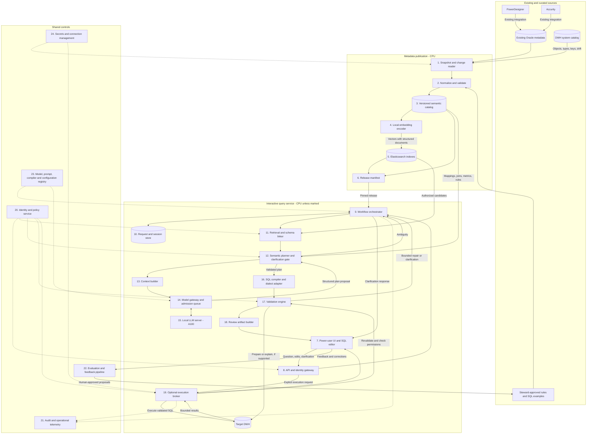
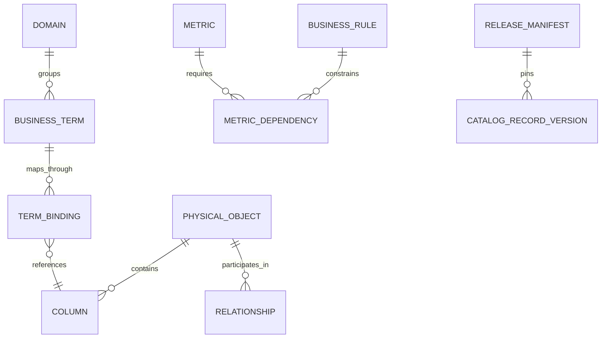
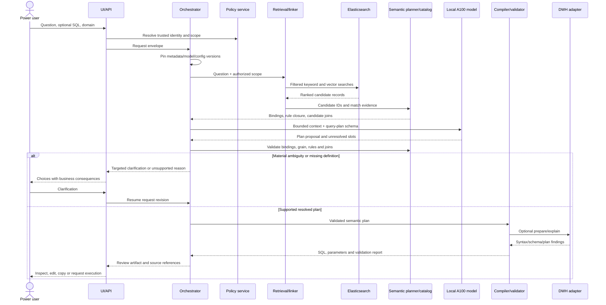

# Logical architecture: on-premises DWH SQL assistant

Design proposal • 23 September 2026

This architecture generates reviewable SQL for power users from business language, existing SQL, or both. Generative inference runs on one A100. Elasticsearch supplies retrieval. The existing Oracle metadata tables provide PowerDesigner and Accurity metadata. The target DWH engine is deliberately unspecified: Oracle storing the metadata does not establish the SQL dialect of the target DWH.

Execution is an optional extension. The baseline product returns SQL, typed parameters, business interpretation, source references, assumptions, and validation findings. All components and data flows remain inside the organization. Component boundaries below are logical; they do not require separate microservices.

## 1. Architecture and responsibility boundaries



The model proposes an interpretation. Application code resolves catalog IDs, enforces permissions and semantic rules, and compiles supported plans. Elasticsearch is a search projection; it is not the authoritative source of metric formulas or join correctness. Retrieved text is data, never an instruction to grant access or execute tools.

## 2. Component responsibilities and contracts

| ID | Component | Input → output | Implementation character |
|---|---|---|---|
| 1 | Snapshot/change reader | Oracle metadata and DWH catalog → staged source records | Scheduled delta reads or CDC when available; periodic full reconciliation |
| 2 | Normalizer/quality gate | Source records and curated rules → validated catalog records or quarantine findings | Stable IDs, type normalization, referential checks, source precedence |
| 3 | Semantic catalog | Published records → exact metadata by ID/version | Separate application schema in Oracle is sufficient; authoritative structured rules |
| 4 | Embedding service | Search text → embedding vector | Local encoder; same version and preprocessing for documents and requests |
| 5 | Elasticsearch | Query text/vector plus policy filters → ranked candidates | BM25, dense-vector search, rank fusion; no DWH fact replication required |
| 6 | Release manifest | Consistent catalog and index versions → immutable release ID | Atomic application-level publication pointer |
| 7 | UI/editor | User question, optional SQL and selected domain → review/clarification/edit interactions | Displays meaning, SQL, parameters, evidence and individual validation statuses |
| 8 | API/identity gateway | Authenticated request → trusted principal and request envelope | SSO integration; request limits; identity derived server-side |
| 9 | Orchestrator | Envelope and pinned versions → bounded workflow | Explicit state machine, deadlines, retries, cancellation and error classification |
| 10 | Session store | Request events and decisions → resumable state | Stores structured intent and revisions, not only a transcript |
| 11 | Retrieval/linker | Question and scope → candidate term/mapping/example IDs with evidence | Hybrid search, alias resolution, rank fusion and optional local reranking |
| 12 | Semantic planner | Candidate bindings and model proposal → resolved plan or clarification | Metric expansion, join planning, grain validation, ambiguity checks |
| 13 | Context builder | Relevant plan candidates/rules → bounded model input | Mandatory dependency closure, deduplication and token budgeting |
| 14 | Model gateway | Bounded inference task → structured output | Queue, token/context caps, timeout, model-version selection and schema validation |
| 15 | LLM server | Context and task schema → intent/plan/repair proposal | Local A100, one resident model initially |
| 16 | SQL compiler | Validated semantic plan → SQL AST, dialect SQL, typed bind parameters | Deterministic supported operators; engine-specific adapter |
| 17 | Validator | SQL/AST, plan and policies → findings and stage statuses | Static SQL checks, semantic checks, optional DWH preparation/plan inspection |
| 18 | Artifact builder | Validated plan and SQL → review artifact | Sources and validation facts assembled from recorded evidence |
| 19 | Execution broker | Artifact revision/hash and parameters → bounded result page | Optional; current entitlements, DB restrictions, timeout and cancellation |
| 20 | Policy service | Principal and resource IDs → effective metadata and execution scope | Deny by default; application checks plus authoritative database enforcement |
| 21 | Audit/telemetry | Stage events → traces, operational metrics, restricted audit records | Redaction, retention and access controls |
| 22 | Evaluation/feedback | Reviewed outcomes and curated tasks → regression reports and proposed examples | Expert review before promotion; no automatic training on user edits |
| 23 | Configuration registry | Approved releases → pinned model/prompt/compiler settings | Rollback and reproducibility |
| 24 | Secret manager | Service identity → scoped connector credentials | No credentials in prompts, embeddings, UI artifacts or ordinary logs |

## 3. Canonical semantic data model

Use stable identifiers independent of display labels. Preserve multiple physical mappings for a term rather than flattening them into one column. Each entity includes source reference, owner, status, effective dates, classification, version and content hash.

| Entity | Essential fields |
|---|---|
| BusinessTerm | term_id, canonical_name, aliases, language, definition, domain_id, source_url |
| PhysicalObject | object_id, connection_id, catalog/schema/name, object_type, grain_key_ids, freshness information |
| Column | column_id, object_id, physical_name, data_type, nullability, key role, sensitivity |
| TermBinding | binding_id, term_id, target column or approved expression ID, source preference, domain applicability, semantic role, conditions |
| Relationship | edge_id, role-specific endpoints, composite key pairs or approved predicate AST, cardinality, uniqueness evidence, permitted direction/join type, temporal conditions, approval status |
| Metric | metric_id, definition, input bindings, expression AST, base grain, aggregation behavior by dimension, currency/unit, mandatory filters, date role, dependencies |
| Dimension | dimension_id, bindings, entity key, hierarchy, supported levels, historical/current behavior |
| BusinessRule | rule_id, applies_to IDs, predicate/expression AST, required/optional status, placement constraints, steward approval |
| ValueDictionary | column/binding ID, allowed code, business label, aliases, validity dates |
| QueryExample | example_id, question, dialect, domain, SQL AST/text, semantic plan, dependency IDs, approved metadata version |
| Domain | domain_id, scope description, authorized objects, supported capabilities, documented defaults |
| ReleaseManifest | release_id, catalog snapshot, physical index names, encoder version, schema fingerprint, publication status |

Expressions must use a controlled expression representation or reviewed templates with typed placeholders. Descriptive prose is insufficient for executable metric definitions. Example dependency order: net-revenue metric → amount expression + cancellation rule + invoice date + currency conversion rule.

One many-to-one relationship with unverified uniqueness is not proof of safe aggregation. Record evidence as declared, profiled, or unknown; profiles can be stale. DWH owners must resolve missing or conflicting business rules.

Example logical relations:



The ER diagram is conceptual. Bindings may also target expressions; relationship endpoints reference two role-specific object instances, and metric dependencies may reference other metrics.

## 4. Metadata publication flow and algorithms

1. **Acquire:** read source snapshots/deltas and assign an ingestion batch ID. For a watermark delta reader, use a consistent source snapshot or overlap window and stable IDs to avoid missing late commits. Reconcile deletions explicitly through tombstones or periodic full snapshots.
2. **Normalize:** retain source IDs; normalize names, types and relationships; hash canonical content. Do not merge terms solely because their labels match.
3. **Validate:** check binding targets, relationship endpoints, composite keys, formula dependencies, cycles and approval states. Compare published physical references with the live DWH catalog when access permits. Quarantine unusable records and their dependent executable rules.
4. **Resolve source conflicts:** the DWH catalog governs physical existence/type; designated glossary owners govern business meaning; designated rule owners govern executable business rules. Conflicts become findings instead of silent overwrites.
5. **Build retrieval documents:** use logical term/binding, table, metric/rule and query-example records. Include domain, IDs, status, source references and access tags. Preserve a parent ID if long descriptions require splitting. Do not arbitrarily split join predicates or formulas.
6. **Embed:** calculate local vectors for changed searchable text only. Structured-only changes still update documents. Any embedding-model or preprocessing change requires a compatible reindex and query-encoder rollout.
7. **Build candidate release:** create versioned catalog data and physical Elasticsearch indexes; check counts, dangling dependencies, entitlement labels, deletion handling and retrieval smoke tests.
8. **Publish:** atomically update one release-manifest pointer only after all artifacts are ready. Readers pin its catalog version and physical index names. Old releases remain available for in-flight work; permission revocations still take effect immediately through live policy checks.
9. **Invalidate:** mark saved examples/artifacts affected by changed object/rule dependencies. Revalidate before reuse or execution.

An Elasticsearch alias can aid administration, but a request must not independently resolve a moving alias and a different catalog version. The pinned release manifest is the consistency boundary.

Suggested index families: `terms`, `schema`, `metrics-rules`, `examples`, each with a release suffix. Code dictionaries may be structured catalog lookups; large approved dictionaries can have their own searchable projection. Index metadata and approved labels, not unrestricted customer records.

## 5. Online request flow



Clarification resumes planning and validation; it does not bypass them. Ordinary requests need one generation call after retrieval. A separate intent-extraction call is optional for complex requests; retries are capped. All generative tasks use the same resident model initially.

## 6. Runtime algorithms

### A. Scope and intent extraction

Resolve the target connection/dialect, principal, current permission version, selected domain, locale, business timezone and reference timestamp. The server supplies identity fields; user prompts cannot override them.

For simple input, deterministic tokenization, glossary aliases and date parsing can initiate retrieval directly. For complex input, ask the model for a constrained intent draft: measures, dimensions, filters, dates, desired grain, ordering and unknowns. Treat every draft field as a proposal. Do not use an uncertain domain classification as an irreversible filter: search several authorized domains or ask for a selection.

When modifying SQL, parse it first and resolve its identifiers into the same semantic representation where supported. Unsupported constructs remain a clearly marked advanced draft; they are not silently simplified.

### B. Hybrid retrieval and entity linking

1. Normalize text with language-aware processing while preserving exact physical identifiers.
2. Generate the query vector locally using the release's encoder.
3. Run BM25 on boosted canonical names, aliases, physical names and descriptions; run vector search on the same authorized/versioned scope.
4. Fuse results using reciprocal rank fusion:

   `score(d) = sum(1 / (k + rank_i(d)))`

   Absent candidates contribute zero. `k = 60` is a starting tuning value, not a confidence threshold.
5. Deduplicate by stable entity ID without losing alternative physical bindings. Optionally rerank the candidate union with a small local cross-encoder if CPU latency permits.
6. Link request phrases to term/metric IDs using exact alias evidence, retrieval ranks, role compatibility and domain compatibility. Preserve competing candidates.
7. Resolve catalog bindings by exact ID and expand all mandatory dependencies.

Starting experimental budgets: top 50 lexical + top 50 vector candidates per relevant search collection, optional reranking of up to 50 fused candidates, and 3–5 approved SQL examples after binding. These are tuning parameters; verify schema recall on the evaluation set. Permission and release filters apply to both search branches and again during dependency expansion.

Elasticsearch documents hybrid search and RRF in its [hybrid search guide](https://www.elastic.co/docs/solutions/search/hybrid-search) and [RRF reference](https://www.elastic.co/docs/reference/elasticsearch/rest-apis/reciprocal-rank-fusion). Use native fusion if supported by the installed version/license, or combine the two Elasticsearch result lists in application code.

### C. Value and temporal resolution

Map labels such as “active” through approved code dictionaries; never invent stored codes. Resolve named entities through an authorized lookup service only if required and explicitly included in scope. Ambiguous entity matches require clarification.

Resolve relative dates from the recorded reference timestamp, business timezone and calendar. For “last year,” use the documented calendar default or ask whether the user means calendar/fiscal year. Represent date filters as typed half-open intervals `[start, end)` when appropriate. Require a semantic date role, such as invoice date or payment date, not merely a DATE-typed column.

### D. Join planning

Maintain an in-memory adjacency view of the versioned relationship catalog. Nodes are role-specific table instances: billing customer and shipping customer remain distinct even if they use the same physical table. Edges carry complete key predicates, permitted join type/direction, cardinality, temporal rule and approval status.

Algorithm:

1. Expand metric dependencies and identify required base facts, dimensions and time roles.
2. Prefer approved domain query patterns or approved join subgraphs.
3. Otherwise enumerate bounded candidate paths between required nodes over eligible edges. Use nonnegative weighted shortest paths or bounded k-shortest-path search; combine candidates into a connected subgraph and prune redundant edges. This is a bounded heuristic, not a guarantee of the globally optimal join tree.
4. Rank feasible candidates by approved source preferences and lower structural complexity. Unknown temporal semantics, forbidden relationships and unsafe cardinality are hard constraints, not merely small penalties.
5. Add intermediate tables even when retrieval did not return them.
6. Validate the chosen subgraph against output grain, metric aggregation rules, join optionality, predicate placement and temporal behavior.
7. If multiple business-distinct paths remain, ask the user to choose. If no supported path exists, report the missing relationship.

Do not equate shortest path with correct business meaning. A purchase can join to the purchaser, payer or account owner through equally short paths.

### E. Grain and aggregation validation

Represent the grain of each fact and intermediate relation as entity/key IDs. Track which joins preserve rows and which can multiply them. For a measure from a base fact, require proof or an approved rule that aggregation after joins preserves its intended meaning.

For multiple facts, aggregate each fact independently to an approved common grain and join those aggregates using conformed dimensions. A many-to-many bridge requires an explicit allocation/deduplication rule. Do not use `DISTINCT` or `SUM(DISTINCT amount)` as a generic repair for fan-out.

Metrics must describe additive, semi-additive or non-additive behavior. Ratios may require aggregating numerator and denominator separately; averages may require weights; balances may need an end-of-period rule. If the catalog lacks the relevant rule, ask or return an unsupported-plan finding.

### F. Context assembly

Build a typed context package containing the authorized catalog slice, selected and competing bindings, complete join predicates, metric formulas, temporal/code rules, relevant examples, dialect/capability description, explicit user decisions and unresolved slots.

Budget rule:

`context_budget = configured_context_limit - output_budget - instruction_tokens - safety_margin`

Pack mandatory rules and dependency closure first. Add optional descriptions and examples by relevance within the remaining budget. Never truncate a required join predicate or omit a required filter merely to fit the prompt. If mandatory context cannot fit, narrow scope or return a clarification request. Token counts use the actual deployed model tokenizer.

### G. Constrained plan generation

Use schema-constrained output where supported. Let the model choose among supplied catalog IDs and supported operators rather than invent physical identifiers. The output is a semantic plan proposal, not trusted executable text. It must represent unresolved decisions explicitly.

vLLM provides structured generation using JSON schemas and grammars; see its [structured output documentation](https://docs.vllm.ai/en/latest/features/structured_outputs/). Valid structure does not establish valid business semantics, so application validation remains mandatory.

Initial supported operators: projection, typed filters, approved joins, grouping, approved metrics, ordering, limits and a small set of reviewed window/CTE patterns. Advanced operations can be added through compiler capabilities. Direct LLM SQL generation is an optional advanced-draft route; it must pass the same checks, and unprovable semantics remain visible and ineligible for automatic execution.

### H. SQL compilation

Resolve plan IDs against the pinned catalog. Build a SQL abstract syntax tree (AST) from approved expressions and operators; apply mandatory predicates at their correct logical location; generate stable aliases and typed bind parameters; render through a target-engine adapter.

Do not string-concatenate user values into SQL. Identifiers come from authorized catalog bindings, since ordinary parameter binding does not bind table names. Outer-join predicates require particular care: moving a right-side condition into `WHERE` can change a left join's meaning.

The dialect adapter owns identifier quoting/case, date operations, parameter style, pagination, supported functions, null behavior and engine validation capabilities. Implement and verify one target dialect first.

### I. Validation and bounded repair

Run checks in order:

| Layer | Checks | Failure action |
|---|---|---|
| Contract | JSON schema, required slots, allowed operators, catalog ID membership | One structured repair or clarification |
| Syntax/AST | Exactly one supported read query; inspect nested statements; allowed functions/constructs | Reject unsupported or potentially side-effecting constructs |
| Names/types | Resolve aliases, CTE scopes, columns, types and parameters | Repair binding/type error without changing the intended metric |
| Policy | Current object/column permission, classification, required row policy | Stop or re-scope; never “repair” by bypassing policy |
| Semantics | Grain, joins, metrics, dates, currency, nulls, output dimensions and rule coverage | Clarify missing meaning or reject unsupported plan |
| Database | Prepare/parse or non-executing plan inspection where supported | Classify live schema, syntax or resource findings |
| Resource envelope | Required bounded dates, estimated plan indicators, timeout/workload policy | Request narrower scope or decline execution |

Database plan inspection is dialect-specific and may require auxiliary permissions or write a plan table. It must not use a command that executes the query, such as an execution-enabled analyze mode. Estimated costs are heuristics, not portable runtime guarantees. A read query can invoke side-effecting functions, so statement type alone is insufficient; use restricted database privileges and a controlled function surface.

Allow at most two repair attempts and a total deadline as initial policies. Give a repair task only the relevant redacted error, approved context and immutable business decisions. Revalidate from the beginning after a change. Detect repeated equivalent failures using a normalized plan/SQL fingerprint. Stop on unsupported semantics, policy failures or repeated errors.

### J. Clarification and evidence-based status

Trigger clarification when multiple valid definitions materially alter results, required date/grain/currency information is missing, or business-distinct mappings remain unresolved. Present the alternatives in business language with their consequence; preserve the selected term/rule IDs in session state.

Do not treat retrieval scores or the model's reported confidence as a probability of correctness. Use explicit statuses such as `needs_clarification`, `draft`, `static_checks_passed`, `database_checks_passed`, `blocked` and `unsupported`. A skipped database check stays `not_run`; it is never reported as passed. An optional future risk score must be calibrated on labeled local evaluation data.

## 7. Data contracts

Each stage carries a request ID, revision and pinned release/config versions. Payloads below are illustrative; IDs, schema names and rules are fictitious.

**RequestEnvelope**

```json
{
  "request_id": "req-001",
  "revision": 1,
  "principal_id": "server-resolved-user",
  "policy_version": "policy-42",
  "question": "Revenue by customer last year",
  "connection_id": "dwh-primary",
  "dialect": "configured-engine-version",
  "domain_ids": ["sales"],
  "locale": "en",
  "business_timezone": "Europe/Bucharest",
  "reference_timestamp": "2026-09-23T10:00:00+03:00",
  "catalog_release": "catalog-017"
}
```

**Resolved semantic plan**, after the user has selected invoiced revenue, calendar year and customer at invoice time:

```json
{
  "plan_version": "1",
  "catalog_release": "catalog-017",
  "metric_ids": ["metric.invoiced_revenue"],
  "dimension_ids": ["dimension.customer_at_invoice"],
  "grouping_key_ids": ["customer.business_id", "customer.name_at_invoice"],
  "time_filter": {
    "role_id": "date.invoice_date",
    "operator": "half_open_interval",
    "start_parameter": "p_start",
    "end_parameter": "p_end"
  },
  "parameters": {
    "p_start": {"type": "date", "value": "2025-01-01"},
    "p_end": {"type": "date", "value": "2026-01-01"}
  },
  "relationship_ids": ["join.invoice_customer_at_invoice"],
  "mandatory_rule_ids": ["rule.exclude_cancelled", "rule.reporting_currency"],
  "desired_grain": ["customer.business_id", "customer.name_at_invoice"],
  "unresolved_slots": []
}
```

This example deliberately exposes a grain choice: grouping by historical customer name can split one customer into several rows when the name changes. If the user wants exactly one row per customer, the display-name rule must be resolved separately. Grouping by name alone can merge different customers with identical names.

**ReviewArtifact** contains:

- Request/plan/artifact revision IDs; principal scope; catalog, model, prompt and compiler versions.
- SQL text, typed parameters, SQL/parameter hash and target connection/dialect.
- Business interpretation and explicit assumptions/clarifications.
- Output-column lineage to binding, term, metric and rule IDs; source links generated from catalog records.
- Validation results by layer, including `passed`, `failed` or `not_run`, plus timestamps.
- Unresolved limitations, execution eligibility and eligibility expiry/revalidation requirement.

Explanations are assembled from validated plan facts and provenance. An optional model paraphrase must not invent sources or make claims beyond recorded checks.

## 8. Execution and editing flow

The baseline is generate → inspect → edit/copy. Execution can be omitted without weakening SQL generation.

When enabled:

1. The user submits an explicit execution request referencing the exact artifact revision/hash and parameter values.
2. The broker rechecks current identity/entitlements, target schema compatibility and artifact validity. Editing SQL or values invalidates previous validation and requires new checks.
3. Establish a constrained database session using the user's identity or a verified delegated policy context; never a broadly privileged account without equivalent database-enforced restrictions.
4. Apply database statement timeout, workload/resource controls, fetch limits and cancellation. A result row limit is not a scan-cost limit.
5. Execute using typed binds. Return bounded/paginated results directly to the UI. The LLM does not need query results to generate SQL.
6. Record the execution ID, artifact hash, policy context, timing and outcome. Result rows are not placed in general telemetry or Elasticsearch by default.

Any later result-explanation feature is a separate authorized data flow with its own result-size and classification policy.

## 9. State, operational behavior and deployment

Request states:

```text
RECEIVED -> AUTHORIZED -> RETRIEVING -> PLANNING
PLANNING -> NEEDS_CLARIFICATION -> PLANNING
PLANNING -> COMPILING -> VALIDATING -> READY_FOR_REVIEW
VALIDATING -> REPAIRING -> VALIDATING
READY_FOR_REVIEW -> EDITED -> VALIDATING
READY_FOR_REVIEW -> EXECUTION_REQUESTED -> REVALIDATING -> EXECUTING -> COMPLETED
Any applicable stage -> UNSUPPORTED | BLOCKED | FAILED | CANCELLED
```

Transitions have typed error reasons and bounded attempt counts. An execution failure does not silently trigger broader access or altered business semantics.

| Deployment area | Logical components |
|---|---|
| Existing systems | Oracle metadata, target DWH, identity provider, PowerDesigner and Accurity integrations |
| CPU application service | API, orchestrator, retrieval, planner, compiler, validation, artifact construction, session management |
| CPU background worker | Metadata publication, embedding jobs, evaluations and curated-example maintenance |
| Elasticsearch cluster | Metadata, semantic and example retrieval |
| A100 inference service | One resident generative model behind a gateway and bounded admission queue |
| Shared platform services | Secrets, policy integration, telemetry, configuration/artifact storage |

Use a local small embedding encoder and optional cross-encoder on CPU if they meet measured latency. These are encoders, not a second generative LLM. If they must share the A100, benchmark reserved capacity or schedule offline embedding work so it does not disrupt interactive generation. Do not swap large models for each workflow step.

Configure A100 memory based on weights + runtime buffers + KV cache at the chosen context/concurrency. A 40 GB card suggests evaluating a smaller BF16 model or a quantized 32B model; an 80 GB card provides more options. vLLM's [quantization compatibility table](https://docs.vllm.ai/en/latest/features/quantization/) lists supported Ampere paths. Actual model/quantization selection requires local SQL evaluation and load testing.

Use admission control with bounded active requests, context/output limits, cancellation and fair queuing. Treat the proposed retrieval budgets, repair counts and model sizes as experimental settings. A single A100 cannot supply redundant inference availability; if it fails, browsing metadata and reviewing saved SQL can remain available while new generation is unavailable.

Start with a modular application and worker rather than deploying every box separately. Separate model serving and Elasticsearch because their resource and lifecycle needs differ.

Cache keys include catalog release, model/prompt/compiler versions, target dialect, normalized request/decisions, principal or entitlement fingerprint, and relevant time context. Recheck current permissions on cache access. Do not reuse result data across principals through a generation cache.

| Failure | Required behavior |
|---|---|
| Metadata release build fails | Keep last valid release; report publication failure and freshness |
| Current permissions cannot be verified | Stop protected retrieval/execution |
| Elasticsearch unavailable | Report retrieval unavailable; do not improvise unseen schema |
| Model unavailable or queue full | Return retryable status; keep editor/catalog browsing usable |
| Mandatory rule is absent | Ask for clarification or report unsupported definition |
| DWH validation unavailable | Return draft with database checks explicitly not run |
| Live schema has drifted | Invalidate affected artifact, refresh metadata and regenerate/revalidate |
| Repair budget exhausted | Return actionable findings; do not label the query validated |

## 10. Evaluation, maintenance and release algorithm

Create an expert-reviewed dataset from actual power-user tasks, split by business scenario rather than superficial wording. Keep held-out tasks and paraphrases out of retrieved example sets where they would leak answers. Use fixed database snapshots or controlled fixtures for result comparisons, together with expert semantic review and edge-case data: accidental equality on one dataset does not prove equivalence.

Measure each layer separately:

| Layer | Metrics |
|---|---|
| Retrieval | Recall of required terms, bindings, tables and rules; unauthorized exposure rate |
| Planning | Correct metric/date/grain selection, join validity, ambiguity detection and clarification burden |
| SQL | Syntax/type validity, execution success, correct results and business interpretation |
| User outcome | Time to accepted query, extent of edits, acceptance/rejection reasons |
| Serving | Queue wait, generation latency, total latency, throughput, GPU memory and error rate |
| Policy | Permission regression cases, nested construct rejection, row/column enforcement and revoked-access behavior |

Release sequence: candidate model/prompt/catalog/compiler → offline regression → expert review of changed behavior → small pilot → monitored rollout → rollback if predefined acceptance gates fail. Establish those gates with stakeholders after baseline measurements; do not assume an accuracy percentage in advance.

Store user corrections as proposals. A steward approves business definitions, joins and examples before they become authoritative retrieval material. Invalid or outdated examples are removed from eligible retrieval when their dependencies change.

## 11. Implementation boundary and open decisions

First implementation: one DWH dialect, one or two domains, generate/edit/copy, structured metadata publication, hybrid retrieval, approved join paths, metric rules, constrained planning, deterministic SQL compilation and static validation. Add database validation where accessible. Add execution only if required by the product scope.

Decisions needed before physical sizing or detailed implementation:

1. A100 memory capacity, availability to this service, host RAM and deployment platform.
2. DWH engine/version, supported SQL surface, schema size and schema-change process.
3. Peak simultaneous requests, acceptable queue/response latency, availability expectations.
4. Existing coverage of join cardinality, grain, historical rules, metric formulas and approved SQL.
5. Elasticsearch version/license and existing authentication/authorization facilities.
6. User languages, business calendars/timezones and permitted metadata/value exposure.
7. Generation-only versus optional execution, and the required user-identity propagation model.

These affect configuration and integration choices. They do not change the central responsibility split: search retrieves evidence, the model proposes a plan, the semantic planner resolves business meaning, and deterministic code validates and compiles the supported SQL.
