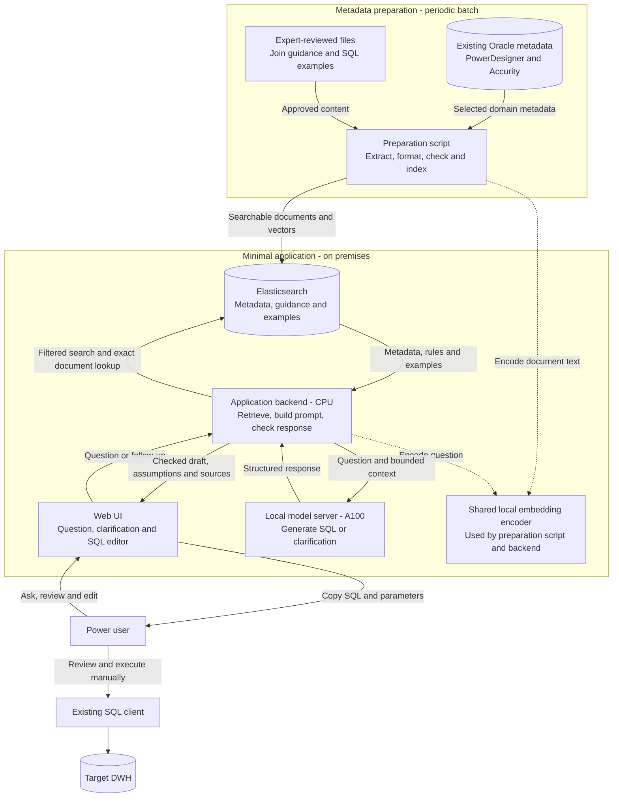
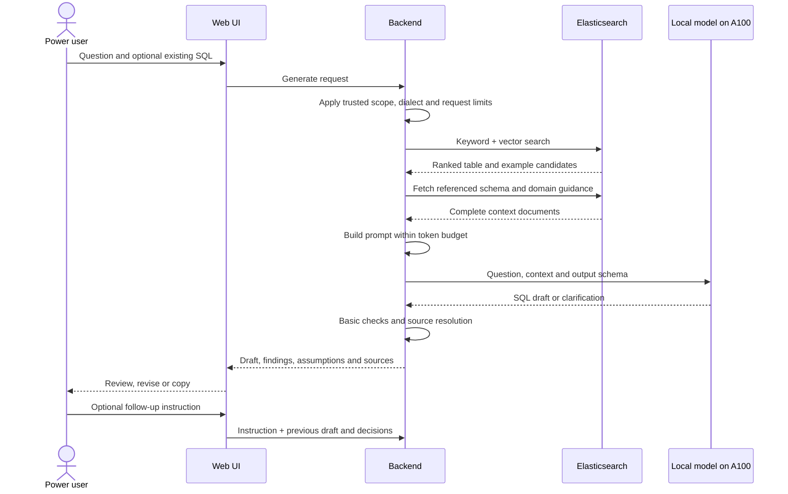

# Minimal logical architecture: DWH SQL drafting assistant

Status: proposed POC / MVP design • 23 September 2026

**Objective:** help power users reach a correct DWH query faster by generating an editable SQL draft from their question, existing metadata, and approved SQL examples. Users review and execute the SQL through their existing database tools.

**Scope:** one business domain, one target DWH dialect, one local generative model on the A100, and Elasticsearch retrieval. PowerDesigner and Accurity metadata is already accessible in Oracle. The Oracle metadata database does not determine the target DWH dialect.

## 1. Logical architecture



There are four runtime components: **web UI, application backend, Elasticsearch, and local model server**. The preparation script is a batch job. The embedding encoder is a shared local library/model loaded by the job and backend, not a separate service. Run the encoder on CPU initially and measure latency.

The backend is one application with ordinary functions. No agent framework, semantic compiler, graph database, independent planner, or automatic SQL execution service is required.

## 2. Components and responsibilities

| Component | Responsibilities | Output |
|---|---|---|
| Oracle metadata source | Supply selected tables/views, columns, business definitions and mappings | Domain metadata snapshot |
| Approved content files | Supply table grain, join predicates, business/date rules and example queries | Small reviewed Markdown/JSON content set |
| Preparation script | Extract metadata, combine guidance, validate references, encode text and publish the index | Searchable domain knowledge |
| Elasticsearch | Store documents, keyword fields, vectors, types, domain IDs, dependencies and source references | Relevant context and exact dependency documents |
| Web UI | Accept questions; display SQL, clarification, assumptions and sources; support editing/copying | User requests and feedback |
| Backend | Apply configured domain/access scope; retrieve context; prompt model; perform basic checks | Draft response or actionable error |
| Local embedding encoder | Encode document text and questions using the same version/settings | Search vectors |
| Local model server | Host one generative model on A100; return SQL drafts or clarification | Structured response |

Use an application configuration file for the selected domain, target dialect/version, model endpoint, encoder version, retrieval limits, context limits and timeouts. Connector credentials belong in protected configuration or the existing secret-management facility, never in prompts or indexed documents.

## 3. The minimum knowledge package

Start with one useful domain, approximately 10–20 tables/views, and 10–20 approved SQL examples. These are starting sizes, not fixed requirements. Prefer existing reporting views or data marts if they already implement the required business logic.

Index three document types in one logical Elasticsearch index:

| Document type | Required content | Retrieval use |
|---|---|---|
| `table` | Fully qualified physical name; description; grain; columns/types; linked business terms and aliases; source links | Find physical objects from business language |
| `guidance` | Domain definitions; approved complete join predicates; required filters; date roles; current/historical behavior; code mappings where needed | Constrain how SQL is constructed |
| `example` | Business question; approved SQL; explanation; dialect; referenced table/guidance IDs | Adapt known working query patterns |

Each document also contains `document_id`, `domain_id`, `document_type`, `content_version`, `source_references`, and dependency IDs. Physical names must be preserved exactly. Multiple mappings for one term remain visible rather than being silently collapsed.

The concrete model is defined in [Elasticsearch metadata model](elasticsearch-metadata-model.md), with an [index mapping](elasticsearch-index-mapping.json) and [four sample documents](elasticsearch-sample-documents.json).

| Stored content | Indexed search/filter fields | Preserved structured payload |
|---|---|---|
| Common envelope | Document type, domain, target connection/dialect, access scope, version, title, searchable text and embedding | Source references |
| Table/view | Physical identifiers, business-term IDs/names and aliases | Exact schema, columns/types, keys, grain and column-to-term mappings |
| Guidance | Searchable rule descriptions, dependency IDs and required-for-domain flag | Complete join predicates, business/date rules and code mappings |
| SQL example | Question/meaning in searchable text and dependency IDs | Reviewed SQL, parameter definitions, explanation and review reference |

Business terms remain attached to their exact columns in the table payload. Root search fields are denormalized retrieval aids. The model uses one index and exact ID lookups, with no Elasticsearch join or separate term index. The mapping's vector dimension and the examples' Oracle SQL dialect are illustrative configurations to replace with actual deployment choices.

For wide tables, retrieve small searchable descriptions first and fetch the associated schema detail by exact document ID. Store complete guidance documents; do not split a join predicate across arbitrary text chunks.

Example guidance, to be replaced by actual approved rules:

```text
Domain: Sales
Revenue: invoiced amount, excluding cancelled invoices.
Period: invoice date, using the calendar year.
Customer join: invoice.customer_key = customer.customer_key.
Customer interpretation: the customer version referenced by the invoice.
Output grain: identify customers by business key, not name alone.
```

The POC does not turn this prose into an executable rules engine. The model follows it, and the user reviews the resulting SQL. A DWH expert must supply missing rules rather than expecting the model to infer them.

## 4. Data flow A: prepare the knowledge

Run manually for the POC and on a schedule for the MVP:

1. Read the selected domain's metadata from Oracle.
2. Merge the reviewed join guidance and SQL examples by stable object IDs.
3. Check that referenced tables/columns exist in the supplied metadata. Flag missing targets and inconsistent definitions for the owner.
4. Build the three document types with source references and dependency IDs.
5. Generate embeddings locally using the same encoder that will encode user questions.
6. Build a new physical Elasticsearch index and run a small set of retrieval checks.
7. Switch the application's active index alias after successful completion. Keep the previous index available for in-flight requests and rollback.

A full rebuild of this small domain is the simplest starting algorithm. CDC, a separate semantic catalog, and incremental dependency services are unnecessary for the POC. Each request resolves the active alias once and uses that physical index for all its retrieval calls.

Show metadata refresh time in the UI. If refresh fails, keep the previous valid index and expose its age. A metadata snapshot can be stale relative to the DWH; the application does not claim live database validation.

## 5. Data flow B: generate a SQL draft



No DWH query is executed in this flow. A normal request makes one generation call. Follow-ups repeat retrieval and checks using current metadata; the backend carries the previous draft and explicit decisions, not an unbounded conversation history.

## 6. Algorithms inside the backend

**A. Retrieval.** Filter by the configured domain and permitted metadata scope. Run BM25 keyword search over business terms, physical names and descriptions, and vector search over document embeddings. Combine rankings using reciprocal rank fusion:

`RRF(document) = sum(1 / (k + rank_in_each_list))`

Use a starting `k` of 60 and modest candidate lists, such as 20 hits per search branch. Preserve exact-name matches as candidates. Select a small set of relevant table documents and approximately three approved examples; tune these limits using local questions. RRF ranks relevance, not correctness.

**B. Context completion.** Fetch every schema document referenced by selected examples, plus the small domain guidance bundle. Include intermediate tables explicitly referenced by the guidance. This is an exact dependency lookup, not a graph search or join-planning algorithm. The curated domain bundle must include the relationships needed for supported questions.

**C. Context budgeting.** Count tokens with the deployed model's tokenizer. Reserve space for instructions and output. Remove low-ranked examples and optional descriptions first. If required schema and guidance cannot fit, ask the user to narrow the question; do not silently drop essential rules.

**D. Generation.** Ask the model to adapt an approved example when applicable, otherwise use the supplied schema and guidance. Require it to:

- Use the configured SQL dialect and supplied physical identifiers.
- Follow the documented joins, metric definitions and filters.
- Represent user-supplied values using named placeholders where supported, and list their values/types separately.
- Return a targeted clarification if an essential definition is missing or ambiguous.
- Produce one SQL draft, a short interpretation, assumptions and supporting document IDs.

Use structured output when the selected local server/model combination supports it. Otherwise parse and validate the response format in the backend. Low-temperature generation is a starting setting, not a guarantee of determinism or correctness.

**E. Basic checks.** Parse the SQL using a parser that supports the selected dialect. Check that it is a single supported read query, resolve aliases and CTE scopes, and compare physical table/column references against the supplied metadata. Unsupported parser constructs or unresolved references produce a visible finding rather than a false pass. Check returned source IDs against retrieved documents and generate links in application code.

These checks do not prove safe functions, correct joins, correct totals, current database permissions, runtime performance or business correctness. Required business rules remain guidance plus user review in this minimal version. Syntax failures return a revision-needed response; there is no autonomous repair loop.

## 7. Minimal request and response contracts

The backend supplies trusted identity/scope and resolves the target dialect from configuration. The client cannot broaden its access by naming another domain.

**Request:**

```json
{
  "question": "Show invoiced revenue by customer for last calendar year",
  "domain_id": "sales",
  "previous_sql": null,
  "confirmed_decisions": []
}
```

The backend records a request ID, metadata index/version, model/prompt version, reference timestamp, and business timezone. Relative dates use this recorded context and documented calendar rules. A missing date role or calendar definition may require clarification.

**Response:**

```json
{
  "status": "draft",
  "sql": "<generated SQL in the configured dialect>",
  "parameters": [],
  "interpretation": "Invoiced revenue grouped by customer business identifier.",
  "assumptions": [],
  "clarification_question": null,
  "sources": ["table.invoice", "table.customer", "guidance.sales"],
  "checks": {
    "syntax": "passed",
    "identifiers": "passed",
    "business_correctness": "not_verified",
    "database_execution": "not_run"
  }
}
```

Possible statuses: `draft`, `needs_clarification`, `needs_revision`, `unsupported`, and `error`. Check results are assigned by backend code, never accepted from model self-assessment. The example response describes the contract, not a real generated or validated query.

## 8. Minimal user interface

One page is sufficient:

- A fixed domain label, or an authorized domain selector if more than one is later enabled.
- A question box and Generate button.
- A SQL editor with copy and optional download actions.
- A short interpretation, assumptions, parameter values and source references.
- Individual check findings, clearly identifying the output as a draft.
- A follow-up box for changes or clarification answers.
- Useful / needs correction feedback, with optional corrected SQL.

Clarifications can be ordinary responses answered in the next request. No separate conversational platform is needed. If the user edits SQL directly, invalidate the previous check results until they request another check; never leave a stale passed indicator beside edited SQL.

Copy SQL and its parameter manifest together, or clearly display how to bind values in the user's client. Execution remains in the existing SQL client under existing DWH permissions.

## 9. Deployment, errors and POC-to-MVP changes

Deploy the UI and backend together if convenient. Run the preparation script on the same CPU host or existing scheduler. Reuse the existing Elasticsearch deployment. Host one generative model on the A100; choose its size and precision after confirming whether the card has 40 GB or 80 GB and measuring representative requests.

For a small POC, allow a bounded number of active generation requests and return a clear busy state. Add a simple bounded queue, timeout and cancellation behavior for the MVP. No second GPU model or external inference service is required by this design.

| Condition | Behavior |
|---|---|
| No relevant schema or rule | Ask for a narrower question or report the missing information |
| Ambiguous business definition | Return one targeted clarification |
| Missing join guidance | Do not present an invented relationship as approved; return clarification/unsupported |
| Elasticsearch/model unavailable | Return a clear retryable error; preserve the user's question |
| Output cannot be parsed or identifiers cannot be resolved | Mark revision needed and show actionable findings |
| Metadata refresh fails | Retain last valid index and show metadata age |
| Direct SQL edit | Invalidate previous check status |

For the POC, use a restricted internal deployment with a participant group authorized for the same domain metadata. If access differs between users, enforce authentication and per-user scope from the beginning. For MVP rollout, integrate existing SSO and server-side scope filtering; do not rely on UI filtering or prompts for permissions.

Keep minimal operational logs: request ID, versions, stage timings, error category and user feedback. Restrict and redact stored questions/SQL according to organizational policy. Do not log credentials or replicate DWH result rows. Feedback is a proposal: expert review is required before adding corrected SQL to the approved example library.

| POC | MVP addition |
|---|---|
| Manual knowledge preparation | Scheduled refresh and failure visibility |
| One domain and small authorized cohort | Existing SSO and required metadata access controls |
| Generate, inspect and copy | Follow-up edits, feedback and polished error handling |
| Manually reviewed evaluation questions | Repeatable regression checks before changes |
| Single-request or limited-load serving | Bounded queue, measured capacity and operational monitoring |

The logical architecture remains the same between POC and MVP.

## 10. Acceptance and implementation order

1. Select one domain and one DWH dialect; collect approximately 30–50 representative evaluation questions with expert-reviewed expected answers.
2. Assemble metadata, join guidance and approximately 10–20 approved SQL examples. Keep evaluation answers out of the retrieval example set.
3. Load the local model on A100 and create the Elasticsearch knowledge index.
4. Implement retrieval, prompt assembly, one generation call and the basic checks.
5. Add the single-page UI and run a pilot with 3–5 power users.
6. Compare time to a correct query with and without the assistant; record corrections, clarification burden, unsupported requests and latency.
7. Improve guidance/retrieval first, then consider model or prompt changes based on observed failures.

Agree numerical acceptance targets after a baseline measurement. SQL that parses or executes is not necessarily business-correct; domain experts assess the final interpretation and results using existing tools.

Deferred capabilities: automatic execution, result explanation, enterprise-wide domain coverage, executable semantic rules, automatic join planning, fine-tuning, autonomous repair, and query optimization. These are possible later extensions, not POC dependencies.

## Technical references

- [Elasticsearch hybrid search](https://www.elastic.co/docs/solutions/search/hybrid-search): keyword/vector retrieval.
- [Elasticsearch reciprocal rank fusion](https://www.elastic.co/docs/reference/elasticsearch/rest-apis/reciprocal-rank-fusion): combining ranked result lists; use the installed version/license's supported interface, or fuse Elasticsearch result lists in the backend.
- [vLLM structured outputs](https://docs.vllm.ai/en/latest/features/structured_outputs/): an available local-serving mechanism for constrained response structure if selected for implementation.

The broader design is retained in [logical-architecture.md](logical-architecture.md) as a future reference. This minimal design is the implementation scope for the POC / MVP.
